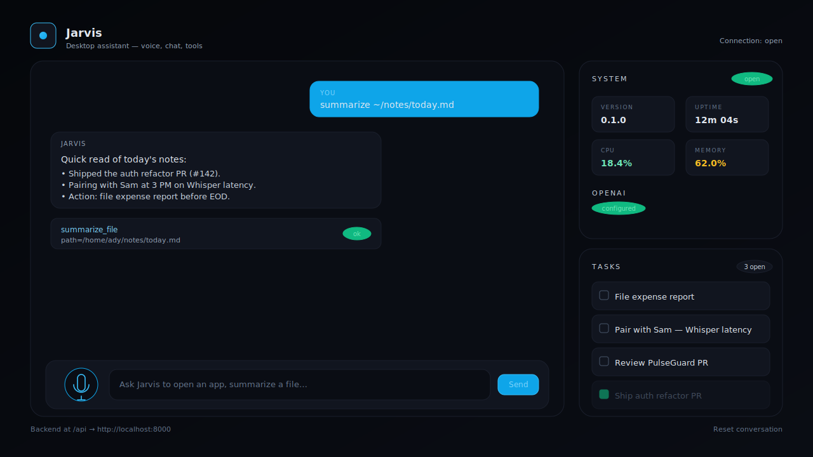

# Jarvis Desktop Assistant

A production-grade, voice-driven desktop assistant. Modular Python backend powering an OpenAI-backed tool-using agent, and a polished React dashboard for chat, voice input, system status, and task memory.



---

## Highlights

- **Voice input** — record from the browser, transcribed by OpenAI Whisper.
- **Conversational agent** — OpenAI tool-calling loop over a modular tool registry.
- **Command router** — fast deterministic regex routes for common intents, with LLM fallback for everything else.
- **Real desktop tools** — open applications, automate a headless browser, summarize files, manage a persistent task list, inspect system health.
- **Pluggable** — drop a Python file into `backend/app/plugins/` and your tool is auto-registered.
- **Conversation memory** — persisted in SQLite, survives restarts.
- **Live UI** — WebSocket streaming, status panel, tool-call traces, task list.
- **Containerized** — single-command Docker Compose for the whole stack.

## Architecture

```
┌──────────────────────────┐        WebSocket / REST         ┌──────────────────────────────┐
│   React Dashboard        │  ←────────────────────────────→ │   FastAPI Backend            │
│   (Vite + TS + Tailwind) │                                 │                              │
│                          │                                 │   ┌──────────────────────┐   │
│   • Mic + Whisper STT    │                                 │   │ Command Router       │   │
│   • Conversation view    │                                 │   │  (regex fast path)   │   │
│   • Tool-call traces     │                                 │   └─────────┬────────────┘   │
│   • Status panel         │                                 │             │ miss           │
│   • Task list            │                                 │   ┌─────────▼────────────┐   │
└──────────────────────────┘                                 │   │ Agent (OpenAI loop)  │   │
                                                             │   └─────────┬────────────┘   │
                                                             │             │                │
                                                             │   ┌─────────▼────────────┐   │
                                                             │   │ Tool Registry        │   │
                                                             │   │  + Plugin Loader     │   │
                                                             │   └─────────┬────────────┘   │
                                                             │             │                │
                                                             │  ┌──────────┴───────────┐    │
                                                             │  │ Tools (one module    │    │
                                                             │  │  each):              │    │
                                                             │  │  open_application    │    │
                                                             │  │  browse_web          │    │
                                                             │  │  summarize_file      │    │
                                                             │  │  add/list/complete/  │    │
                                                             │  │    delete_task       │    │
                                                             │  │  system_info         │    │
                                                             │  │  + your plugins      │    │
                                                             │  └──────────────────────┘    │
                                                             │                              │
                                                             │   SQLite ← conversation +    │
                                                             │           task memory        │
                                                             └──────────────────────────────┘
```

Each tool is a small class declaring a Pydantic argument schema and an `async run()` method. The registry generates OpenAI function-calling schemas automatically.

## Quick start (Docker)

```bash
cp .env.example .env
# edit .env and add OPENAI_API_KEY=sk-...

docker compose up --build
```

- Frontend: <http://localhost:8080>
- Backend API + OpenAPI: <http://localhost:8000/docs>

## Local development

### 1. Backend

```bash
cd backend
python -m venv .venv && source .venv/bin/activate
pip install -e ".[dev]"
playwright install chromium      # enables the browse_web tool

# from repo root
cp .env.example .env             # then set OPENAI_API_KEY

uvicorn app.main:app --reload
```

The API is served at <http://localhost:8000>. Interactive docs at `/docs`.

Run the test suite:

```bash
pytest
```

Lint and type-check:

```bash
ruff check . && ruff format --check .
mypy app
```

### 2. Frontend

```bash
cd frontend
npm install
npm run dev
```

Open <http://localhost:5173>. Vite proxies `/api/*` to the backend (override the proxy target with `VITE_API_BASE_URL`).

Lint / typecheck / build:

```bash
npm run lint
npm run typecheck
npm run build
```

## Configuration

All runtime configuration is read from environment variables (or a `.env` file at the repo root). See [`.env.example`](./.env.example) for the full list.

Notable knobs:

| Variable | Default | Purpose |
| --- | --- | --- |
| `OPENAI_API_KEY` | _(required)_ | Auth for chat + Whisper |
| `OPENAI_CHAT_MODEL` | `gpt-4o-mini` | Chat model used by the agent |
| `OPENAI_WHISPER_MODEL` | `whisper-1` | Whisper model used for STT |
| `JARVIS_DB_PATH` | `./data/jarvis.db` | SQLite file for memory |
| `JARVIS_ENABLE_*` | `true` | Per-tool feature toggles |
| `JARVIS_BROWSER_ENGINE` | `chromium` | Playwright engine |
| `JARVIS_BROWSER_HEADLESS` | `true` | Headless browser flag |
| `VITE_API_BASE_URL` | _(empty)_ | Where the frontend should call the backend; empty uses the dev proxy |

## API surface

| Method | Path | Description |
| --- | --- | --- |
| `GET` | `/health` | Liveness probe |
| `GET` | `/status` | Version, uptime, CPU/mem, tool list, OpenAI readiness |
| `POST` | `/chat` | Single-turn chat (request/response) |
| `WS` | `/chat/ws` | Streaming chat events: `tool_call`, `reply`, `error` |
| `POST` | `/stt` | Multipart audio → Whisper transcript |
| `GET` | `/tools` | All registered tools and their JSON schemas |
| `POST` | `/tools/{name}/run` | Directly invoke a tool (handy for debugging plugins) |
| `GET` | `/tasks` | List tasks (`?status_filter=open` or `done`) |
| `POST` | `/tasks` | Create a task |
| `POST` | `/tasks/{id}/complete` | Mark a task complete |
| `DELETE` | `/tasks/{id}` | Delete a task |

## Writing a plugin

Create a Python file inside `backend/app/plugins/`. Any `Tool` subclass declared in the module (or any `Tool` instance in a top-level `TOOLS` list) is auto-registered on startup.

```python
# backend/app/plugins/jokes.py
from pydantic import BaseModel, Field
from app.tools.base import Tool

class JokeArgs(BaseModel):
    topic: str = Field(description="Subject for the joke.")

class JokeTool(Tool):
    name = "tell_joke"
    description = "Tell a short, family-friendly joke about a topic."
    parameters_model = JokeArgs

    async def run(self, topic: str) -> dict:
        return {"setup": f"Why did the {topic} cross the road?", "punchline": "..."}
```

Restart the backend. The tool now appears in `GET /tools` and is callable by the agent.

## Project layout

```
.
├── backend/                 FastAPI service
│   ├── app/
│   │   ├── core/            agent, router, registry, memory, schemas
│   │   ├── tools/           built-in tools (one module each)
│   │   ├── plugins/         drop-in plugin directory
│   │   ├── routers/         FastAPI routers
│   │   ├── services/        OpenAI + Whisper integrations
│   │   ├── config.py
│   │   ├── logging_config.py
│   │   └── main.py
│   ├── tests/
│   ├── Dockerfile
│   └── pyproject.toml
├── frontend/                Vite + React + Tailwind dashboard
│   ├── src/
│   │   ├── components/
│   │   ├── hooks/
│   │   ├── lib/
│   │   ├── App.tsx
│   │   └── main.tsx
│   ├── Dockerfile
│   └── nginx.conf
├── docker-compose.yml
├── .env.example
└── README.md
```

## License

MIT — see [LICENSE](./LICENSE).
